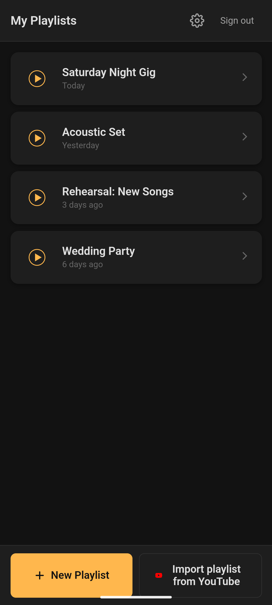
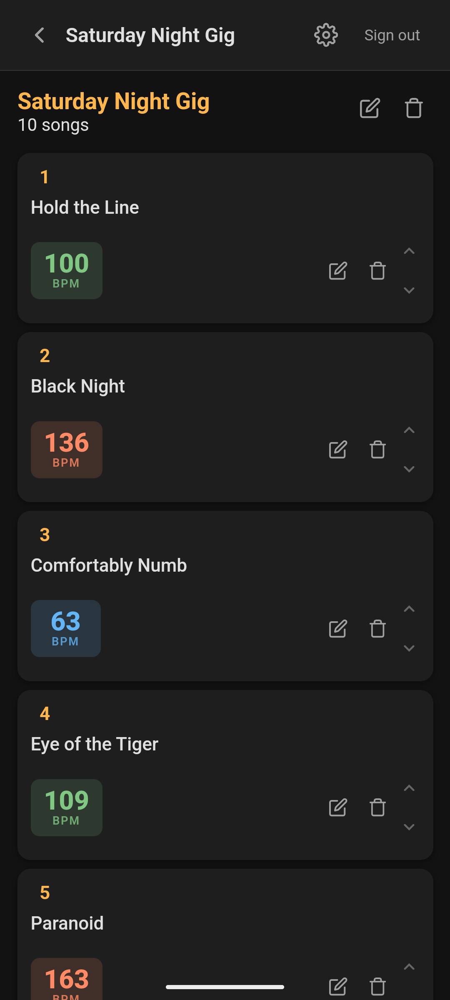
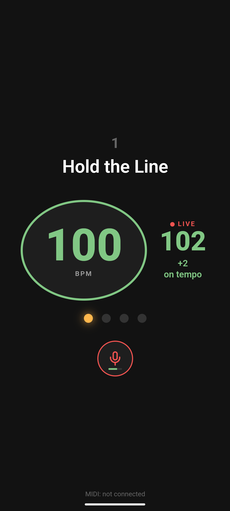
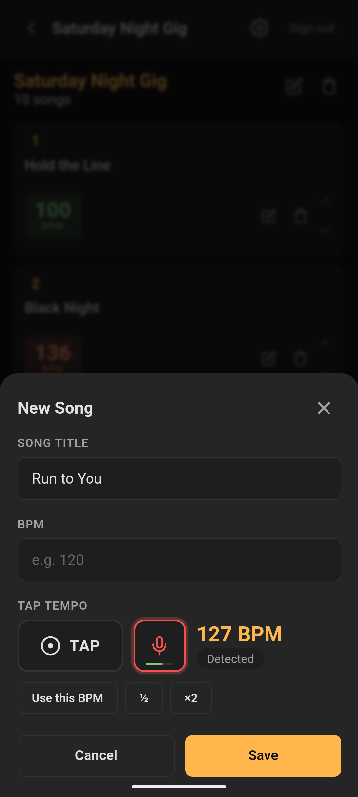

# LiveTempo

Manage song playlists with BPM references for live performances. Each song has a reference BPM so you always know how to set the tempo before starting.

## Screenshots

<p>
  
  
  
  
</p>

Playlists · songs with color-coded BPM · tempo view with the live tempo check · BPM detection from the microphone

## Features

- **Accounts** -- sign up with email and password; playlists sync through Firebase
- **Playlists** -- create, rename, and delete playlists
- **Songs with BPM** -- add songs with title and BPM
- **Tap Tempo** -- calculate BPM by tapping the rhythm on a button
- **Automatic BPM detection** -- tap the microphone button and the app detects the tempo of the music playing around you (analyzed on the device, audio never leaves it; half/double buttons fix octave errors)
- **Live tempo check** -- in the tempo view, the microphone button shows the tempo the band is actually playing next to the song's set BPM, with a hint to speed up or slow down
- **PWA** -- installable on Android as a native app
- **Dark theme** -- optimized for low-light live environments
- **Color-coded BPM** -- slow (blue), medium (green), fast (orange)

## Setup

### 1. Firebase

1. Go to [Firebase Console](https://console.firebase.google.com/)
2. Create a new project (or use an existing one)
3. Enable **Authentication** > Sign-in method > **Email/Password**
4. Enable **Cloud Firestore** in production mode
5. Go to Project Settings > General > Your apps > Web app (</>)
6. Register the app and copy the `firebaseConfig` object

### 2. Configuration

Edit `public/src/js/firebase-config.js` with your Firebase project values:

```js
const firebaseConfig = {
  apiKey: 'AIzaSy...',
  authDomain: 'your-project.firebaseapp.com',
  projectId: 'your-project',
  storageBucket: 'your-project.appspot.com',
  messagingSenderId: '123456789',
  appId: '1:123456789:web:abc123...'
};
```

Edit `.firebaserc` with your Firebase project ID.

### 3. Deploy (Web Hosting - free)

```bash
npm install -g firebase-tools
firebase login
firebase deploy
```

The app will be available at `https://YOUR-PROJECT.web.app`

### 4. Deploy Android APK (for F-Droid)

The Android APK is automatically built by GitHub Actions when you create a tag.

```bash
# Create a new release
git tag v1.0.0
git push origin v1.0.0
```

GitHub Actions will build the APK and publish it as a Release.

### 5. Publishing on F-Droid

1. Make sure the GitHub repository is public
2. Go to [F-Droid Data](https://gitlab.com/fdroid/fdroiddata)
3. Create a merge request adding the metadata file for LiveTempo
4. Once accepted, F-Droid will automatically build the app on every new tag/release on GitHub

The metadata template is in `fdroid/metadata.yml`.

### 6. Firestore Security Rules

The rules in `firestore.rules` let each user read and write only their own
playlists, and only the songs of those playlists. Deploy them with:

```bash
firebase deploy --only firestore:rules
```

## Local Development

```bash
# Install dependencies (also copies the Firebase SDK into public/vendor)
npm install

# Start a local server
npx serve public
# Or with Python
python -m http.server 8080 -d public
```

Open `http://localhost:8080` in the browser.

## Tech Stack

- **Frontend**: Vanilla HTML/CSS/JS (PWA)
- **Auth**: Firebase Authentication (email/password)
- **Database**: Firebase Firestore
- **Hosting**: Firebase Hosting (free tier)
- **Android**: Capacitor (WebView wrapper for native APK)
- **CI/CD**: GitHub Actions

## License

MIT
